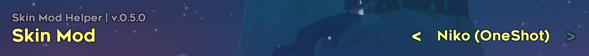

Celeste Skin Mod Helper
==========================
This is an [Everest](https://everestapi.github.io/) mod for [Celeste](http://www.celestegame.com/) 
that provides tools and support for skin modding.


Installation Guide
------------------
1. Install [Everest/Olympus](https://everestapi.github.io/) for [Celeste](http://www.celestegame.com/).
2. Install [Skin Mod Helper (Plus)](https://gamebanana.com/mods/473796) from GameBanana.
3. Install any compatible skin mod from GameBanana.

Features
------------
**For Players**:


choose player skin and collectible etc skins at any time in the game, without restarting, 
Allows you to personalize combination them


 
**For Skin Modders**:

Reskin the game! Solve the hard coding in game programs and provide their reskin solutions. such as:
```yaml
* Provided bangs, for player and badeline etc.  
* Provided death particles, for player and TheoCrystal etc.  
* Provided new particles and outline, for flyFeathers and Boosters.  
* Provided Refill's reskin compatibility, for maps or skins
* Or more, As long as you needed! 
```
for complete content of reskinable, [check here](https://github.com/AAA1459/SkinModHelper/wiki/Textures-list-of-Various-Type)

Setting up your skin mod correctly requires some configuration. 
See the [guide](docs/guide/README.md) for more information.


Contact
-------
If you encounter any issues or have suggestions in this fork, you can reach me on Discord (AAA1459#7937)


Credits
-------
**Creator**: AAA1459

**Original Creator**: Bigkahuna

**Code Contributors**:
* coloursofnoise
* Maddie
* Viv

**Special Thanks**:
* crowberry
* Nikko
* Zaro